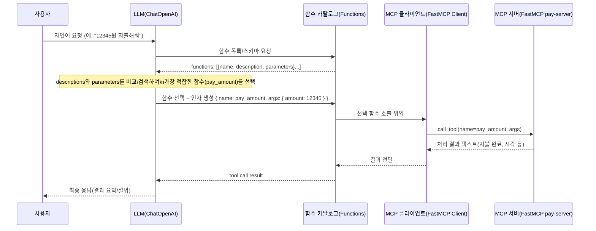

# FastMCP 기반 MCP 서버/클라이언트 실행 가이드

## 1. 의존성 설치

```
pip install -r requirements.txt
```

### .env 예시
```
# OpenAI
OPENAI_API_KEY=your_openai_key

# LangSmith (둘 중 하나)
LANGSMITH=your_langsmith_api_key
# 또는
LANGSMITH_API_KEY=your_langsmith_api_key

# 선택: LangSmith 프로젝트명 지정
LANGCHAIN_PROJECT=mcp-demo
```

## 2. 실행 방법

1) 서버(STDIO) 실행 (권장)
```
python mcp-server/server/stdio_main.py
```

2) UI에서 자동 사용
```
streamlit run main.py
```

3) 설정 파일: `mcp-server/mcp_servers.json` (UI에서 기본 사용)

- 서버는 FastMCP의 STDIO 모드로 구동되며, Streamlit UI에서 LangGraph를 통해 MCP 툴을 호출합니다.
- 제공 툴: `pay_amount(amount:int)` — 정수 금액(원) 입력으로 지불 완료 메시지를 반환합니다.

참고 문서: [FastMCP README](https://github.com/jlowin/fastmcp)

## 3. 디렉토리 구조
```
mcp-server/
  ├─ server/
  │    ├─ app.py        # FastMCP 서버 정의(도구 포함)
  │    ├─ sse_main.py   # SSE 실행 엔트리포인트
  │    └─ stdio_main.py # STDIO 실행 엔트리포인트
  ├─ client/
  │    ├─ sse_main.py    # SSE 전용 클라이언트
  │    ├─ stdio_main.py  # STDIO 전용 클라이언트
  │    ├─ multi_main.py  # 멀티 서버 클라이언트 (mcp_servers.json)
  │    └─ utils.py       # 공통 유틸(run_demo, print_available_tools)
  ├─ mcp_servers.json
  └─ requirements.txt
```

## 4. 참고
- FastMCP: https://github.com/jlowin/fastmcp
- MCP Python SDK: https://github.com/modelcontextprotocol/python-sdk

## 5. LLM → Functions → MCP Client → MCP Server 흐름

다음 다이어그램은 LLM이 함수(functions) 목록의 description/parameters를 확인해 적절한 함수를 선택하고, MCP 클라이언트를 통해 MCP 서버의 툴을 호출하는 전 과정을 보여줍니다.

